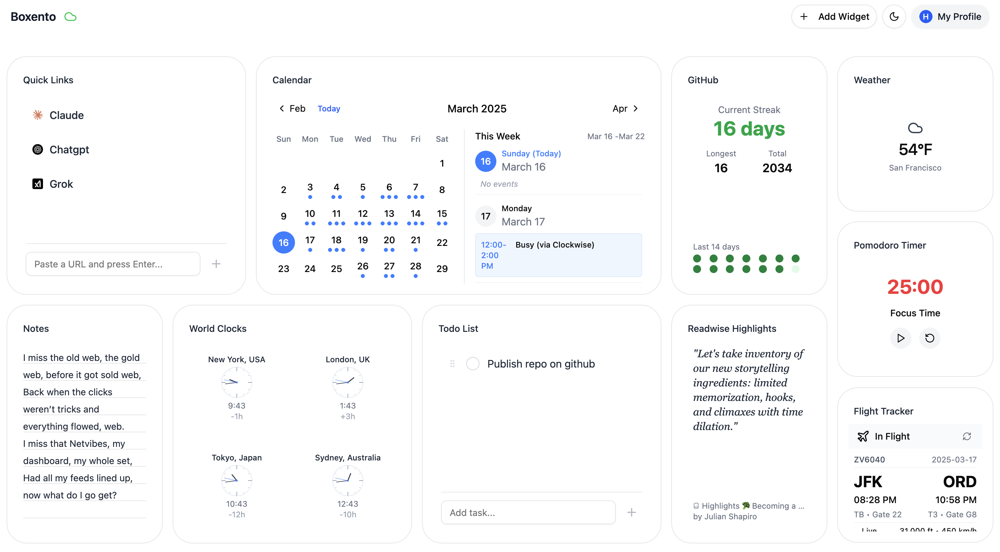
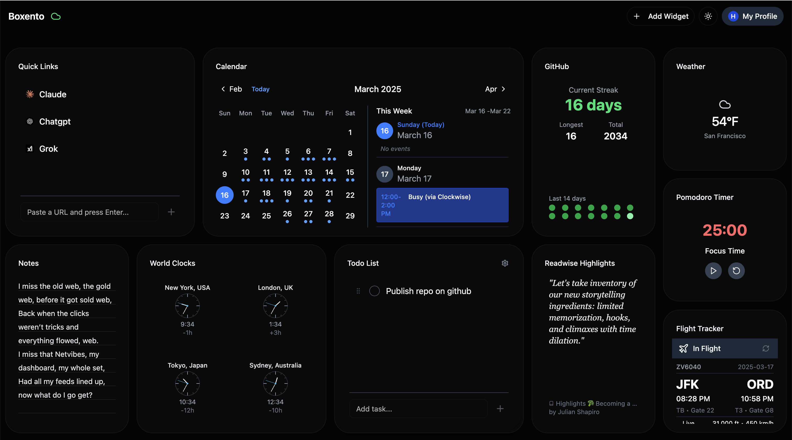

# Boxento



**Project Status:** Beta - Ready for early adopters and contributors! Expect some rough edges, but core functionality is solid.

## 🌟 Bringing Back the Magic of Start Pages

**Remember the golden days of My Yahoo and iGoogle?** Boxento is bringing that back - but better, open source, and completely in your control.

- **Seasoned developers** can dive deep into our codebase
- **Hobby coders** can modify existing widgets to suit their needs
- **Complete beginners** can use LLMs like ChatGPT, Claude, or LLM based code editors like Cursor or Windsurf to help generate widget code

There are no gatekeepers here - just bring your imagination, and we'll help you make it real. Check out our [Widget Development Guide](/docs/WIDGET_DEVELOPMENT.md) and [Template Widget](/src/components/widgets/TemplateWidget) to get started.

## 📋 Table of Contents
- [Why Boxento?](#-why-boxento)
- [What is Boxento?](#-what-is-boxento)
- [Installation](#-installation)
  - [Quick Start](#quick-start)
  - [Docker Installation](#docker-installation)
  - [Development Setup](#development-setup)
- [Making Boxento Your Own](#-making-boxento-your-own)
- [Progressive Web App Support](#-progressive-web-app-support)
- [For Developers and Tinkerers](#-for-developers-and-tinkerers)
- [Community & Support](#-community--support)
- [Roadmap](#️-roadmap)
- [License](#-license)

## 🔍 Why Boxento?

While big tech has abandoned customizable start pages, we believe in:

- **Your dashboard, your rules**: Unlike closed platforms, you own and control everything
- **Open source freedom**: Modify, extend, or completely transform it to suit your needs
- **Self-hosted privacy**: Your data stays on your systems
- **Creative expression**: Build your perfect internet starting point, exactly how you want it

## ✨ What is Boxento?

Boxento transforms your new tab or home page into a personalized command center with widgets that matter to you:

- ☑️ Track your to-dos and stay productive
- 🌤️ Check the weather without leaving your start page
- 🔗 Organize your favorite websites in one place
- 📝 Keep notes and ideas at your fingertips
- 🧩 Add more widgets or create your own!

All in a modern interface that gives you that warm, familiar feeling of the web's golden era.

## 🚀 Installation

### Quick Start

#### Option 1: Use the Online Demo
Visit our [live demo](https://boxento.app) to try Boxento instantly.

#### Option 2: Local Installation
**Prerequisites:**
- Bun (v1.0+)
- Git

```bash
git clone https://github.com/sushaantu/boxento.git
cd boxento
bun install
bun run dev
```

Visit [http://localhost:5173](http://localhost:5173) to see your personal dashboard.

### Docker Installation

We provide multiple ways to run Boxento using Docker, suitable for both development and production environments.

#### Prerequisites
- Docker
- Docker Compose (optional)

#### Quick Start with Pre-built Image
```bash
# Pull and run
docker run -d -p 5173:5173 --name boxento ghcr.io/sushaantu/boxento:1.0.1
```

Need to use a custom domain? Add the VITE_ALLOWED_HOSTS environment variable:
```bash
docker run -d -p 5173:5173 -e VITE_ALLOWED_HOSTS=your-domain.com --name boxento ghcr.io/sushaantu/boxento:1.0.1
```

#### Using Docker Compose
```yaml
# docker-compose.yml
services:
  boxento:
    image: ghcr.io/sushaantu/boxento:1.0.1
    container_name: boxento
    restart: unless-stopped
    ports:
      - "XXXX:XXXX"
    environment:
      - NODE_ENV=production
      - VITE_ALLOWED_HOSTS=XXXXXX
```

```bash
docker compose up -d
```

### Development Setup

#### Local Development with Docker
```bash
# Clone and setup
git clone https://github.com/sushaantu/boxento.git
cd boxento

# Start development container
docker compose up -d

# Stop when done
docker compose down
```

#### Production Deployment
```bash
# Setup environment
cp .env.example .env
# Edit .env with your configuration

# Build and start production
docker compose -f docker-compose.prod.yml up -d
```

#### Domain Configuration
The application automatically allows:
- localhost and 127.0.0.1
- *.docker.internal (Docker Desktop)
- *.orb.local (OrbStack)
- Custom domains via VITE_ALLOWED_HOSTS

To add custom domains:
```bash
VITE_ALLOWED_HOSTS=your-domain.com,another-domain.com docker compose up -d
```

## 📖 Making Boxento Your Own

### Widget Gallery

Boxento comes with a diverse collection of widgets organized by category:

#### Productivity
- **Todo Widget**: Track tasks and stay organized
- **Calendar Widget**: Display upcoming events
- **Notes Widget**: Capture thoughts and ideas
- **Pomodoro Timer**: Boost productivity with time management
- **GitHub Streak Tracker**: Monitor your GitHub activity

#### Information
- **Weather Widget**: Check current conditions and forecasts
- **World Clocks Widget**: Display time across different time zones
- **RSS Feed Widget**: Stay updated with favorite content
- **Readwise Widget**: Access your reading highlights

#### Finance & Travel
- **Currency Converter**: Live exchange rates
- **UF (Chile) Widget**: Display UF value in CLP
- **Flight Tracker**: Monitor real-time flight status

#### Entertainment & Utilities
- **YouTube Widget**: Watch videos directly
- **Geography Quiz**: Test your knowledge
- **Quick Links**: Organize favorite websites

### Customization

1. **Add Widgets**: Click "+" to add widgets
2. **Arrange**: Drag and drop anywhere
3. **Resize**: Grab corners to resize
4. **Configure**: Customize through settings

### Create Your Own Widgets

Anyone can create widgets - no matter your experience level:

1. Check our resources:
   - [Widget Development Guide](/docs/widget-development.md)
   - [Template Widget](/src/components/widgets/TemplateWidget)
2. Fork the repo
3. Use our guides with your favorite tools
4. Share with the community or keep for personal use

## 💻 For Developers and Tinkerers

### Tech Stack
- React
- Vite
- Tailwind CSS
- shadcn/ui

### Contributing
1. Fork and clone the repo
2. Create/update widgets in `/src/components/widgets/`
3. Test locally with `bun run dev`
4. Submit a PR

### Reporting Issues
Found a bug or have a feature request? Open an issue on our [GitHub repository](https://github.com/sushaantu/boxento/issues).

## 📱 Progressive Web App Support

Boxento includes PWA support for:
- **Install on device**: Add to home screen
- **Offline access**: Use without internet
- **Fast loading**: Enhanced performance

See our [PWA Support Guide](/docs/PWA_SUPPORT.md) for details.

## 📚 Community & Support

Join our community:
- [Discord Community](https://discord.gg/4NXFScs5rv)
- [GitHub Discussions](https://github.com/sushaantu/boxento/discussions)

## 🗺️ Roadmap

### Coming Soon (Q2 2025)
- 🔒 **End-to-End Encryption**: Complete data privacy
- 🌐 **Widget Marketplace**: Community-created widgets
- 📱 **Mobile Responsive Design**: Perfect on any device

Want to influence what we build next? Join our [Discord](https://discord.gg/4NXFScs5rv) or open a [feature request](https://github.com/sushaantu/boxento/issues).

## 📄 License

Boxento is open source under the MIT License - free to use, modify, and share.


